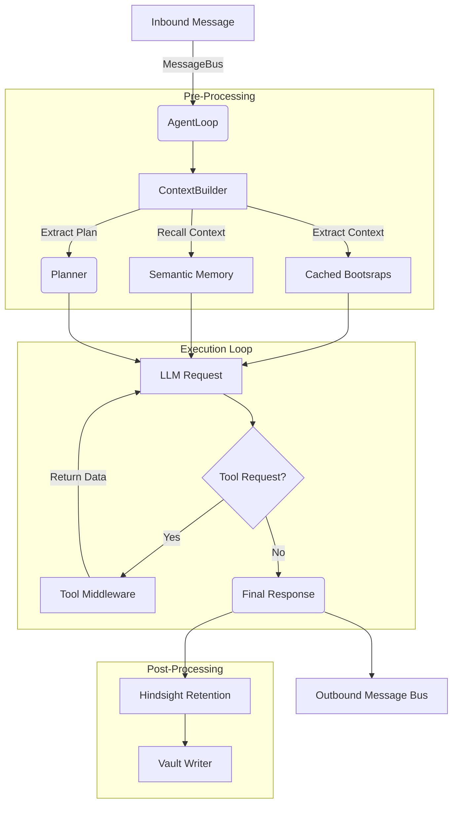

# Agent Core & Cognition Loop

The Agent Loop represents the reasoning layer of Xagent, managing input context, planning operations, executing tools (via the Action phase), and retaining learned insights.

## System Diagram

## Key Mechanisms

- **ContextBuilder**: Merges static persona instructions (`AGENTS.md`) with dynamic state (Epochs, Hindsight experiences). Implements aggressive memory caching to minimize disk I/O per turn.
- **Plan-Act-Reflect**: Integrated directly into `loop.go`. If a complex prompt is detected, the `Planner` generates discrete sub-steps that are embedded in the primary system context, guiding the agent's multi-hop tool execution.
- **Token Summarization**: Implements runtime token checking (via `utf8.runeCount`) to dynamically truncate and summarize the active message history window.
