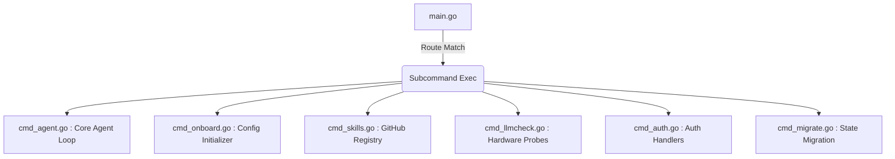

# Command Line Interface (CLI)

The Xagent entrypoint adopts a decentralized file structure for high maintainability.

## Structure Mapping

The primary `cmd/xagent/` namespace separates specific sub-commands dynamically avoiding monolothic switch parsing loops:

## Initialization Handlers

1. Primary setup validates hardware using LLMCheck modules.
2. The config module reads states dynamically, resolving paths against `~/.xagent` configs locally.
3. System daemons inject global variables via init chains natively inside respective target modules rather than polluting `main()`.
