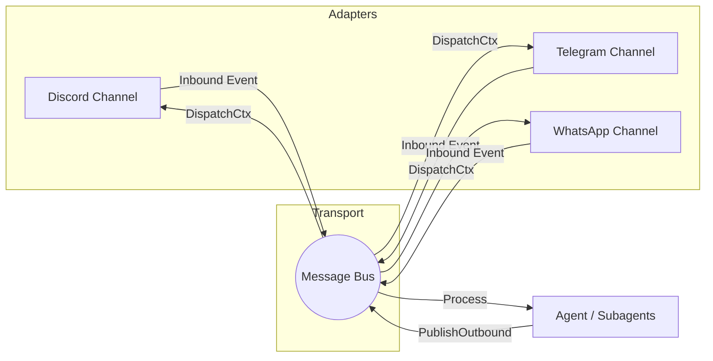

# I/O Channels Routing

The channels layer abstracts connection complexities for specific external surfaces like Discord, Telegram, and WhatsApp into a unified Pub/Sub structure.

## Routing Architecture

## Lifecycle Integrity

- **Centralized Dispatch context**: Instead of orphan threads, background polling (e.g. `WhatsAppChannel.listen()`) and dispatcher goroutines sync tightly with `channel.Start(dispatchCtx)` ensuring graceful shutdowns during state reloading.
- **Event Parity**: All metadata structures format down to `[Channel, ChatID, Content, MediaPaths, Metadata]` standard forms.
