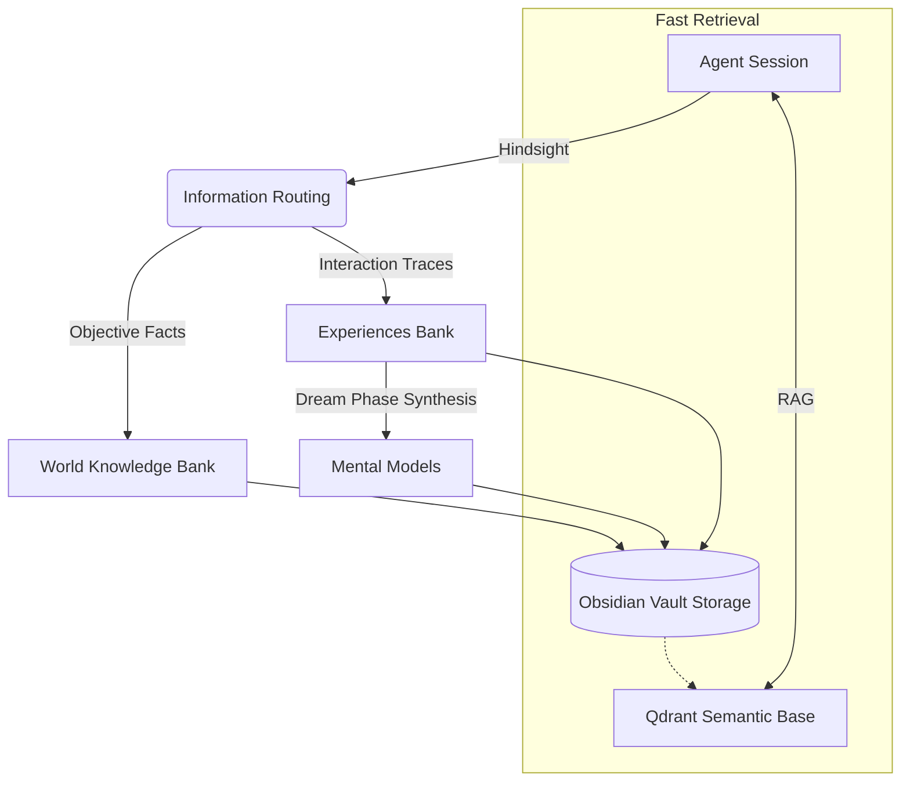

# Memory Engine & Vault

Xagent employs a biological-inspired memory persistence system. It divides knowledge representation across active vector memory and a local Obsidian-compatible vault for long-term graphical reasoning.

## Biomimetic Data Structure

## Storage Concepts

1. **Obsidian Vault (`pkg/vault`)**: 
   - Write operations utilize localized file-locking maps rather than global mutexes, permitting massively parallel throughput across independent topics or tools tracking metrics during RL or long-duration agent epochs.
2. **Qdrant Embedding**: Fast vector searches utilized strictly to populate initial `ContextBuilder` state.
3. **Hindsight & Ephemeral States**: Used primarily as the subjective processing mechanism. Captures the current message trajectory and delegates its extraction into the vault on agent loop completion.
