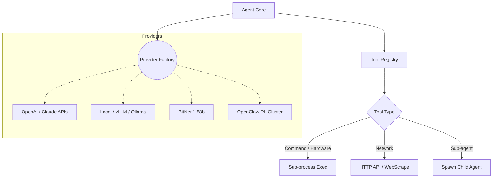

# Providers & Execution Tools

Manages external model inference routing and localized tool registry mapping. 

## Execution Model

## Optimization Mechanics

- **Cached Registry Translation**: LLM APIs require comprehensive schema definitions. The Tool Registry caches these serialized `provider` structures at memory locations invalidated only upon new `Register()` calls, reducing runtime serialization penalties significantly.
- **Fallback Execution**: Providers inherently implement variable backoff timeouts natively. 
- **BitNet Interfacing**: Provides highly specific memory-optimized quantization environments for scaling up edge deployments rapidly under tight thresholds.
